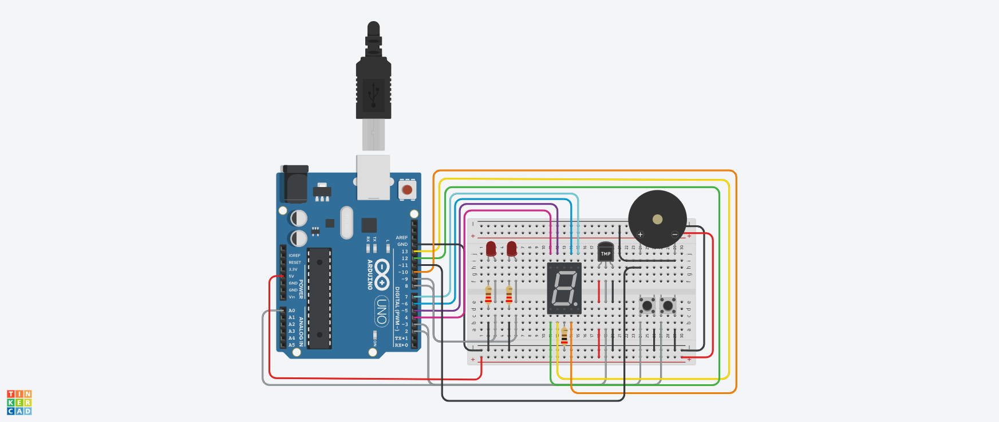

# 1er Parcial SPD
<!-- aqui pongo la imagen tipo portada xd-->

## Nombre y apellido
* Miriam Coanque

## Proyecto: Sistema de incendio
<!-- aqui poner la imagen de mi proyecto-->

## Descripción
El proyecto tiene la función de avisar mediante leds y un buzzer cuando la temperatura va aumentando hasta llegar a encontrarnos en un incendio.

## Función principal 
Esta función se encarga de prender y apagar los leds.

    void prenderApagarLeds(int pin1, int pin2, int tiempo)
    {
    digitalWrite(pin1, HIGH);
    digitalWrite(pin2,HIGH);
    delay(tiempo);
    digitalWrite(pin1, LOW);
    digitalWrite(pin2,LOW);
    delay(tiempo);
    }

Esta función se encarga de hacer zonar el buzzer.

    void sonarBuzzer(int frecuencia, int tiempo)
    {
    tone(BUZZER, frecuencia, tiempo);
    delay(tiempo);
    }

Ambas funciones se llevan a cabo a partir en el que el sensor de temperatura alcance los 60ºC.

## Explicación
El proyecto inicia y termina con el uso de dos botones. Al presionar el primer botón, se activa el sistema de detección de incendios. Al mover el sensor de temperatura, se puede observar la temperatura del ambiente, la cual se muestra en el display mediante niveles. Si la temperatura supera los 60ºC, significa que ha alcanzado el nivel 7. En este punto, se encienden los LEDs en señal de alarma y se activa el buzzer en señal de peligro. El proyecto finaliza al presionar el segundo botón, apagando todo el sistema.

## Link al proyecto
[Proyecto](https://www.tinkercad.com/things/bZaUONOW31h-baseparcial1/editel?returnTo=%2Fthings%2FbZaUONOW31h-funky-juttuli-luulia&sharecode=UB0wDV1eUu-XRs2xWTwUUhveSq05dp9sAqWIW6ydKV8)

